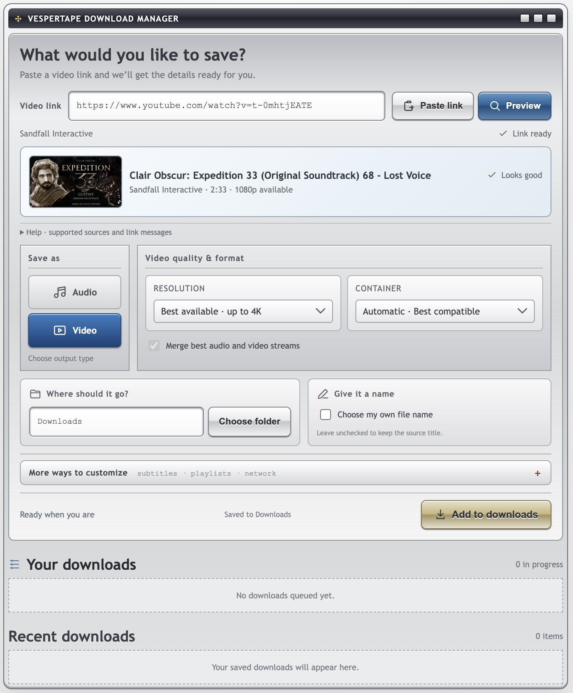

# VesperTape

A self-hosted YouTube downloader for videos, audio, and playlists, powered by
yt-dlp and FFmpeg, with a desktop-inspired web interface.

## Screenshot



## Features

- Preview YouTube links and choose a whole playlist, one item, or a range.
- Download video or audio with quality and format controls.
- Save playlists in folders named after the playlist.
- Follow a persistent queue with thumbnails, progress, pause/resume, cancel, and retry.
- Customize subtitles, metadata, thumbnails, chapters, filenames, and network settings.

## Run the published Docker image

The image includes the frontend, API, FFmpeg, and Node, for AMD64 and ARM64.
After the first successful `master` workflow publishes the package and it is
made public, run:

```sh
docker run -d --name vespertape --init \
  -p 127.0.0.1:8000:8000 \
  -v vespertape-data:/data \
  --cap-drop ALL --security-opt no-new-privileges \
  --restart unless-stopped --stop-timeout 120 \
  ghcr.io/khawarmehfooz/vespertape:latest
```

Open **[localhost:8000](http://localhost:8000)**. Downloads and queue history
persist in the named volume; completed files are accessible through the UI.
To save downloads directly to a host folder, download
[`docker-compose.image.yml`](docker-compose.image.yml), then run:

```sh
docker compose -f docker-compose.image.yml pull
docker compose -f docker-compose.image.yml up -d
```

This saves downloads to `./downloads` by default. Configure the dedicated folder
with `VESPERTAPE_HOST_DOWNLOAD_DIR`. See [published image deployment](docs/container-images.md)
for updates, version pinning, and first-time registry setup.

## Build locally


Install Docker with Compose and Python 3.9+, then run from the repository root:

```sh
# macOS / Linux
python3 scripts/start.py
```

```powershell
# Windows
py scripts/start.py
```

Open **[localhost:8000](http://localhost:8000)**.

The launcher saves files to your OS Downloads folder under `VesperTape` and
records the mapping in `.env`. Playlists get their own named subfolders.
Docker must run on the computer where you want the files saved.

To choose a different destination:

```sh
python3 scripts/start.py --downloads "/path/to/folder"
```

Use `py` on Windows. For other settings, copy [`.env.example`](.env.example)
to `.env` before your first launch, or merge values into your existing `.env`.
See [configuration](docs/configuration.md) and [setup and storage](docs/setup.md).

## Using the app

Paste a YouTube link, choose **Preview**, select audio or video and your settings,
then choose **Add to downloads**. Open completed files in your download folder.
Unavailable playlist items are skipped with a warning. Removing a history entry
leaves its files on disk.

## Documentation

See the [documentation index](docs/README.md) for usage, configuration,
deployment, troubleshooting, development, and the API reference.
